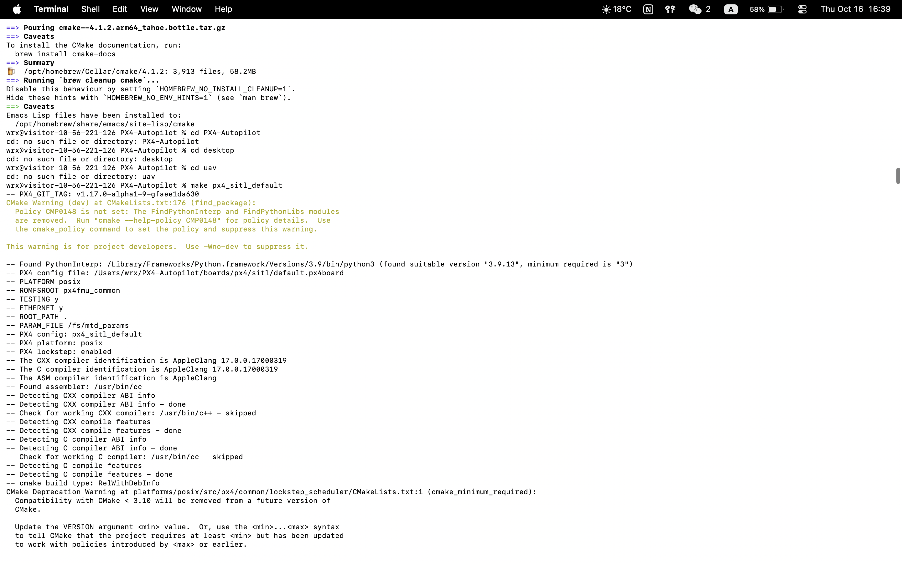
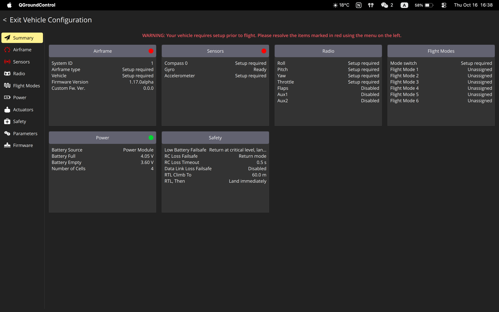
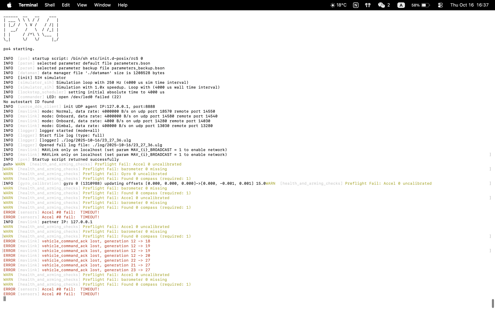

# Skill Booster 4: PX4 SITL + QGroundControl

## Setup Steps Completed

1. ✅ Cloned PX4-Autopilot repository
2. ✅ Installed dependencies with `./Tools/setup/macos.sh`
3. ✅ Ran `make px4_sitl_default`
4. ✅ Connected to QGroundControl
5. ✅ Confirmed MAVLink connection and parameter downloads

## Screenshot

### 1. PX4 SITL Terminal Output

### 2. QGroundControl Connected

### 3. Gazebo
 

## Notes

- Gazebo not installed; used console-only + QGC for validation.
- Errors like uncalibrated sensors expected in SITL.